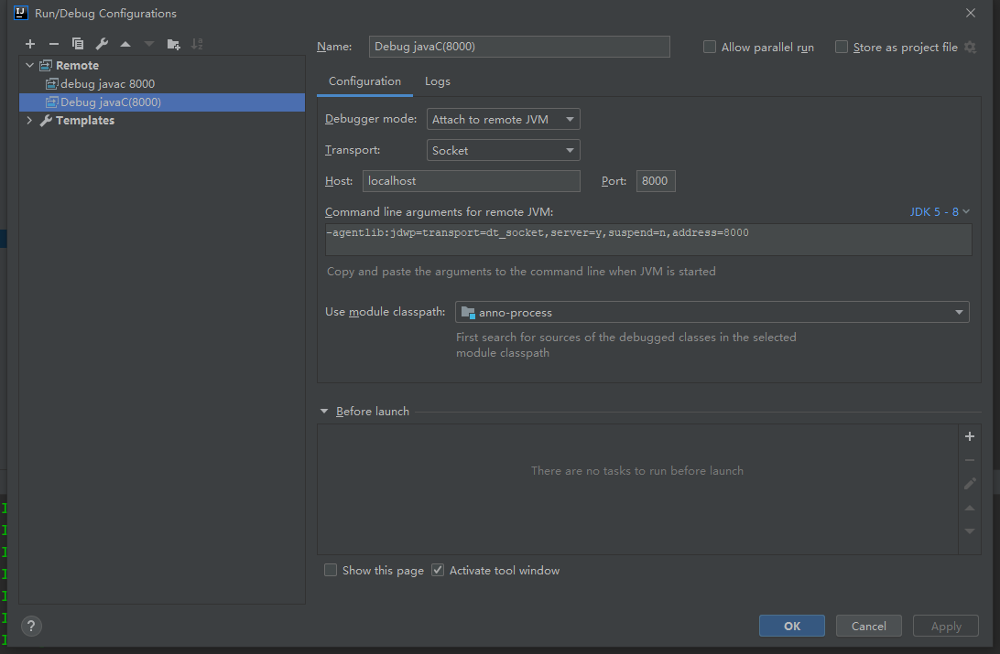
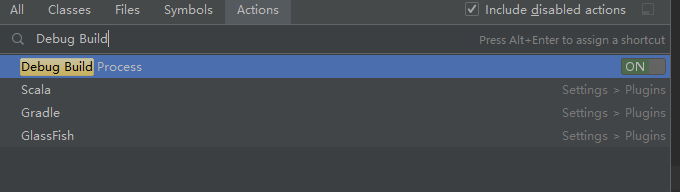
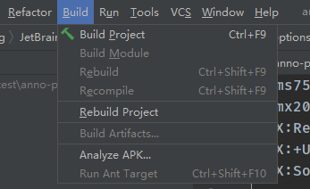

## 自定义注解处理器以及debug

### 定义注解处理器

- 所有注解处理器都继承于AbstractProcessor ，继承该类并重写process方法。
- 在MATE-INF/servives目录下新建javax.annotation.processing.Processor文件，并在其中加上处理器的全类名
- 打包

### debug处理器

以idea为例：

1. 首先创建一个远程调试

2. 修改idea的vm配置，Ctrl+shift+A  Edit Custom VM Options，添加-Dcompiler.process.debug.port=8000，注意端口对应，重启idea
3. Ctrl+shift+A 打开Debug Build Process 配置，这个操作每次重启都要打开

4. 点击编译或者其他能够触发注解处理器的操作，比如：

5. 点击刚刚的远程调试，attach到8000端口进行调试

### 参考

- https://medium.com/@joachim.beckers/debugging-an-annotation-processor-using-intellij-idea-in-2018-cde72758b78a