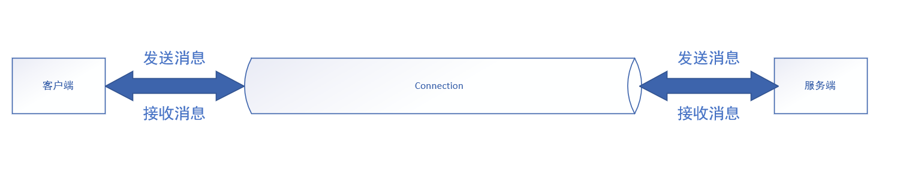

[TOC]

## JDK11-HttpClient

JDK11推出了标准的HttpClient（JEP 321），使用nio以及CompleteFuture实现了异步的客户端。

### 使用样例

```java
// 设置HttpClient打印日志
System.setProperty("jdk.internal.httpclient.debug", "true");
// 使用Builder构建Httpclient。默认的实现类HttpClientImpl
HttpClient httpClient = HttpClient.newBuilder().version(Version.HTTP_2)
    .build();
// 构建Http请求
HttpRequest httpRequest = HttpRequest.newBuilder().uri(URI.create("http://www.baidu.com"))
    .GET()
    .build();
// 发送同步请求，异步请求为sendAsync。返回体封装在HttpResponse中，并且返回结果由BodyHandler处理
HttpResponse<String> httpResponse = httpClient.send(httpRequest, BodyHandlers.ofString());
System.out.println(httpResponse.body());
```

### 源码阅读

#### HttpClient的创建

##### create

```java
static HttpClientFacade create(HttpClientBuilderImpl builder) {
    SingleFacadeFactory facadeFactory = new SingleFacadeFactory();
    HttpClientImpl impl = new HttpClientImpl(builder, facadeFactory);
    // nio selector开始轮询。即执行后面SelectorManager的start方法
    impl.start();
    assert facadeFactory.facade != null;
    assert impl.facadeRef.get() == facadeFactory.facade;
    return facadeFactory.facade;
}
```

在SingleFacadeFactory类上有一段注释，注释大概意思就是表达为什么要使用SingleFacadeFactory（注释大意）：

在HttpClientFacade类中有一个final的HttpClientImpl，在这个HttpClientImpl中又有一个final的WeakReference<HttpClientFacade>。jdk开发人员不能简单的在HttpClientImpl的构造函数中创建一个HttpClientFacade并赋值。因为如果在这时候发生GC，会导致WeakReference指向的内容被回收，导致在返回给应用时的HttpClientFacade为空。

解决办法为：使用SingleFacadeFactory来创建HttpClientFacade，保证初始化时不被GC回收。

到这里，又有一个问题：为啥HttpClientImpl里面要有一个WeakReference<HttpClientFacade>对象。继续翻源码，发现这也有注释。意思大概是：

用一个WeakReference对象来跟踪HttpClient。如果应用代码中没有任何地方引用HttpClientFacade（其实在应用里使用的是HttpClientFacade）。就表示也许可以关闭其内部的循环。为什么要用也许，是因为其内部都是异步执行的代码，需要等全部异步任务都完成才能关闭。

##### init

```java
private HttpClientImpl(HttpClientBuilderImpl builder,
                           SingleFacadeFactory facadeFactory) {
        // .......省略代码
        connections = new ConnectionPool(id);
        connections.start();
        timeouts = new TreeSet<>();
        try {
            selmgr = new SelectorManager(this);
        } catch (IOException e) {
            // unlikely
            throw new UncheckedIOException(e);
        }
        selmgr.setDaemon(true);
        filters = new FilterFactory();
        initFilters();
        assert facadeRef.get() != null;
    }
```

在构造函数中，前面都是builder里面的属性的赋值。这里重点有三个属性：**connections**、**selmgr**、**filters**。其中：

- connections：连接池，内部是由HashMap维护的Connection
- selmgr：nio SelectorKey的管理
- filters：请求的过滤器，目前有三种AuthenticationFilter、RedirectFilter、CookieFilter

看到selmgr，盲猜HttpClientImpl是用nio来发送请求。

##### select

```java
 public void run() {
            List<Pair<AsyncEvent,IOException>> errorList = new ArrayList<>();
            List<AsyncEvent> readyList = new ArrayList<>();
            List<Runnable> resetList = new ArrayList<>();
            try {
                if (Log.channel()) Log.logChannel(getName() + ": starting");
                // 开始轮询。条件为当前轮询线程没有中断
                while (!Thread.currentThread().isInterrupted()) {
                    synchronized (this) {
                        // 这里使用synchronized关键字，和注册事件、取消请求以及关闭服务用同一把锁
                        assert errorList.isEmpty();
                        assert readyList.isEmpty();
                        assert resetList.isEmpty();
                        for (AsyncTriggerEvent event : deregistrations) {
                            event.handle();
                        }
                        deregistrations.clear();
                        // 遍历注册的事件，如果是AsyncTriggerEvent类型的事件，放到readyList中，在接下来执行，否则，取出对应注册到通道中的key，
                        // 并取出对应的SelectorAttachment对象，向通道中注册事件
                        for (AsyncEvent event : registrations) {
                            if (event instanceof AsyncTriggerEvent) {
                                readyList.add(event);
                                continue;
                            }
                            SelectableChannel chan = event.channel();
                            SelectionKey key = null;
                            try {
                                key = chan.keyFor(selector);
                                SelectorAttachment sa;
                                if (key == null || !key.isValid()) {
                                    if (key != null) {
                                        // key is canceled.
                                        // invoke selectNow() to purge it
                                        // before registering the new event.
                                        selector.selectNow();
                                    }
                                    sa = new SelectorAttachment(chan, selector);
                                } else {
                                    sa = (SelectorAttachment) key.attachment();
                                }
                                // may throw IOE if channel closed: that's OK
                                sa.register(event);
                                if (!chan.isOpen()) {
                                    throw new IOException("Channel closed");
                                }
                            } catch (IOException e) {
                                // ...............
                            }
                        }
                        registrations.clear();
                        selector.selectedKeys().clear();
                    }
                    // 对应的AsyncTriggerEvent事件立即执行
                    for (AsyncEvent event : readyList) {
                        assert event instanceof AsyncTriggerEvent;
                        event.handle();
                    }
                    readyList.clear();
                    // 错误事件，是由于通道发送IO异常产生的
                    for (Pair<AsyncEvent,IOException> error : errorList) {
                        // an IOException was raised and the channel closed.
                        handleEvent(error.first, error.second);
                    }
                    errorList.clear();

                 	// ............省略代码
                    //debugPrint(selector);
                    int n = selector.select(millis == 0 ? NODEADLINE : millis);
                    if (n == 0) {
                        // Check whether client is still alive, and if not,
                        // gracefully stop this thread
                        if (!owner.isReferenced()) {
                            Log.logTrace("{0}: {1}",
                                    getName(),
                                    "HttpClient no longer referenced. Exiting...");
                            return;
                        }
                        owner.purgeTimeoutsAndReturnNextDeadline();
                        continue;
                    }

                    Set<SelectionKey> keys = selector.selectedKeys();
                    assert errorList.isEmpty();
                    // 熟悉的nio操作
                    for (SelectionKey key : keys) {
                        SelectorAttachment sa = (SelectorAttachment) key.attachment();
                        if (!key.isValid()) {
                            IOException ex = sa.chan.isOpen()
                                    ? new IOException("Invalid key")
                                    : new ClosedChannelException();
                            sa.pending.forEach(e -> errorList.add(new Pair<>(e,ex)));
                            sa.pending.clear();
                            continue;
                        }

                        int eventsOccurred;
                        try {
                            eventsOccurred = key.readyOps();
                        } catch (CancelledKeyException ex) {
                            IOException io = Utils.getIOException(ex);
                            sa.pending.forEach(e -> errorList.add(new Pair<>(e,io)));
                            sa.pending.clear();
                            continue;
                        }
                        sa.events(eventsOccurred).forEach(readyList::add);
                        resetList.add(() -> sa.resetInterestOps(eventsOccurred));
                    }

                    selector.selectNow(); // complete cancellation
                    selector.selectedKeys().clear();
                    
                    // handle selected events
                    // 处理选择器中准备就绪的事件
                    readyList.forEach((e) -> handleEvent(e, null));
                    readyList.clear();

                    // handle errors (closed channels etc...)
                    errorList.forEach((p) -> handleEvent(p.first, p.second));
                    errorList.clear();

                    // reset interest ops for selected channels
                    resetList.forEach(r -> r.run());
                    resetList.clear();

                }
            } catch (Throwable e) {
                //...............
            } finally {
               // ...............
            }
        }
```

SelectorManager循环的核心代码：

在SelectorManager中有一个registrations属性，提供给外部用来注册事件，事件的实现类有这么几种：

- AsyncTriggerEvent：可以是任何事件，里面包含了一个Runnable
- ConnectEvent：连接完成事件，对应SelectionKey.OP_CONNECT
- WriteEvent：写事件，对应SelectionKey.OP_WRITE
- ReadEvent：读事件，对应SelectionKey.OP_READ

上面几个事件，在循环中，如果是AsyncTriggerEvent类型的事件，会立马执行，如果是其他类型的事件，会通过Selector把通道注册进去。并且在selec中获取感兴趣的事件，循环调用event的handle方法。

而且由于所有的event都是异步的，所以并不会导致一个事件阻塞其他事件。

看到这，可以猜测：在与服务端建立连接后，就可以注册ReadEvent事件，这样当服务端返回消息时，通道中就有数据可以读，触发读事件进行异步返回体的获取。

#### 发送请求

```java
    public <T> HttpResponse<T>
    send(HttpRequest req, BodyHandler<T> responseHandler)
        throws IOException, InterruptedException
    {
        CompletableFuture<HttpResponse<T>> cf = null;

        // if the thread is already interrupted no need to go further.
        // cf.get() would throw anyway.
        if (Thread.interrupted()) throw new InterruptedException();
        try {
            cf = sendAsync(req, responseHandler, null, null);
            return cf.get();
        } catch (InterruptedException ie) {
          //.....
        }
    }
```

可以看到同步发送其实就是在异步发送返回的CompletableFuture上使用get阻塞获取结果。

```java
private <T> CompletableFuture<HttpResponse<T>>
    sendAsync(HttpRequest userRequest,
              BodyHandler<T> responseHandler,
              PushPromiseHandler<T> pushPromiseHandler,
              Executor exchangeExecutor)    {
    		// ........省略
            MultiExchange<T> mex = new MultiExchange<>(userRequest,
                                                            requestImpl,
                                                            this,
                                                            responseHandler,
                                                            pushPromiseHandler,
                                                            acc);
            CompletableFuture<HttpResponse<T>> res =
                    mex.responseAsync(executor).whenComplete((b,t) -> unreference());
            if (DEBUGELAPSED) {
                res = res.whenComplete(
                        (b,t) -> debugCompleted("ClientImpl (async)", start, userRequest));
            }

            // makes sure that any dependent actions happen in the CF default
            // executor. This is only needed for sendAsync(...), when
            // exchangeExecutor is non-null.
            if (exchangeExecutor != null) {
                res = res.whenCompleteAsync((r, t) -> { /* do nothing */}, ASYNC_POOL);
            }
            return res;
        } catch(Throwable t) {
            unreference();
            debugCompleted("ClientImpl (async)", start, userRequest);
            throw t;
        }
    }
```

异步发送方法中，使用MultiExchange的responseAsync来获得response。接下来就是一堆方法的调用封装，直接走到核心方法：

```java
    CompletableFuture<Response> responseAsyncImpl0(HttpConnection connection) {
        Function<ExchangeImpl<T>, CompletableFuture<Response>> after407Check;
        bodyIgnored = null;
        if (request.expectContinue()) {
            request.addSystemHeader("Expect", "100-Continue");
            Log.logTrace("Sending Expect: 100-Continue");
            // wait for 100-Continue before sending body
            after407Check = this::expectContinue;
        } else {
            // send request body and proceed.
            after407Check = this::sendRequestBody;
        }
        // The ProxyAuthorizationRequired can be triggered either by
        // establishExchange (case of HTTP/2 SSL tunneling through HTTP/1.1 proxy
        // or by sendHeaderAsync (case of HTTP/1.1 SSL tunneling through HTTP/1.1 proxy
        // Therefore we handle it with a call to this checkFor407(...) after these
        // two places.
        Function<ExchangeImpl<T>, CompletableFuture<Response>> afterExch407Check =
                (ex) -> ex.sendHeadersAsync()
                        .handle((r,t) -> this.checkFor407(r, t, after407Check))
                        .thenCompose(Function.identity());
        return establishExchange(connection)
                .handle((r,t) -> this.checkFor407(r,t, afterExch407Check))
                .thenCompose(Function.identity());
    }
```

establishExchange(connection)表示构建对应的Exchange，其内部做的工作就是从连接池中获取一个连接，然后根据HTTP的版本创建对应的HttpExchange。

handle((r,t) -> this.checkFor407(r,t, afterExch407Check))做的就是检查是否需要代理服务器验证，验证完之后执行afterExch407Check方法。

afterExch407Check方法在上面的代码中有定义，它先发送请求头，然后再进行一次407验证，至于为什么要两次，上面的注释有解释。再发送完请求头之后，接着发送请求体。

##### 发送请求头

```java
@Override
    CompletableFuture<ExchangeImpl<T>> sendHeadersAsync() {
        // .............
        if (!connection.connected()) {
            if (debug.on()) debug.log("initiating connect async");
            connectCF = connection.connectAsync(exchange)
                    .thenCompose(unused -> connection.finishConnect());
            Throwable cancelled;
            synchronized (lock) {
                if ((cancelled = failed) == null) {
                    operations.add(connectCF);
                }
            }
            if (cancelled != null) {
                if (client.isSelectorThread()) {
                    executor.execute(() ->
                        connectCF.completeExceptionally(cancelled));
                } else {
                    connectCF.completeExceptionally(cancelled);
                }
            }
        } else {
            connectCF = new MinimalFuture<>();
            connectCF.complete(null);
        }

        return connectCF
                .thenCompose(unused -> {
                    CompletableFuture<Void> cf = new MinimalFuture<>();
                    try {
                        asyncReceiver.whenFinished.whenComplete((r,t) -> {
                            if (t != null) {
                                if (debug.on())
                                    debug.log("asyncReceiver finished (failed=%s)", (Object)t);
                                if (!headersSentCF.isDone())
                                    headersSentCF.completeAsync(() -> this, executor);
                            }
                        });
                        connectFlows(connection);

                        if (debug.on()) debug.log("requestAction.headers");
                        List<ByteBuffer> data = requestAction.headers();
                        synchronized (lock) {
                            state = State.HEADERS;
                        }
                        if (debug.on()) debug.log("setting outgoing with headers");
                        assert outgoing.isEmpty() : "Unexpected outgoing:" + outgoing;
                        appendToOutgoing(data);
                        cf.complete(null);
                        return cf;
                    } catch (Throwable t) {
                        if (debug.on()) debug.log("Failed to send headers: %s", t);
                        headersSentCF.completeExceptionally(t);
                        bodySentCF.completeExceptionally(t);
                        connection.close();
                        cf.completeExceptionally(t);
                        return cf;
                    } })
                .thenCompose(unused -> headersSentCF);
    }
```

直到发送请求头中的connection.connectAsync(exchange)代码被执行，才真正建立了连接。

connectFlows方法，把连接池内部的消息管道，与HttpExchange中的读操作的订阅者和写操作的发布者连接在一起。可以这样认为：

连接池中的连接就是一个双向的管道，两端分别连接着客户端和服务端，当我们需要向服务端发送数据时，就需要进行写操作，这时候，写这个动作，由写的发布者进行发布，管道订阅到写的操作时，把数据写入管道。当服务端向客户端发送数据时，管道发现有数据，通过发布者把这个事件发布出去，读操作订阅者接收这个事件，进行读取数据。大致示意图：



```java
//connectFlows相关代码，起内部有一个FlowTube，实现为SocketTube
private void connectFlows(HttpConnection connection) {
    FlowTube tube =  connection.getConnectionFlow();
    if (debug.on()) debug.log("%s connecting flows", tube);

    // Connect the flow to our Http1TubeSubscriber:
    //   asyncReceiver.subscriber().
    tube.connectFlows(writePublisher,
                      asyncReceiver.subscriber());
}
// socketTube的connectFlows方法
@Override
public void connectFlows(TubePublisher writePublisher,
                         TubeSubscriber readSubscriber) {
    if (debug.on()) debug.log("connecting flows");
    this.subscribe(readSubscriber);
    writePublisher.subscribe(this);
}
```

可以看到，FlowTube本身实现了发布（Publisher）和订阅（Subscriber）两个接口，所以在这里既可以作为发布者，也可以作为订阅者。

- 作为订阅者：TubePublisher作为发布者，订阅其发布的消息，TubePublisher的实现为**Http1Exchange.Http1Publisher**，其作用就是当有数据写入时，就进行数据的发布，订阅的实现为**SocketTube.InternalWriteSubscriber**。
- 作为发布者：当读到服务端消息时，发布消息给订阅者，它的订阅者是**Http1AsyncReceiver.Http1TubeSubscriber**，它的实现类是**SocketTube.InternalReadPublisher**。

HttpClient就是通过FlowTube把客户端和服务端通过管道连接的，流程就是：

1. 客户端通过Http1Publisher向InternalWriteSubscriber发布消息，InternalWriteSubscriber订阅到消息之后发送给服务端。
2. 服务端收到消息之后向客户端发送消息，通过nio轮询，处理就绪的读事件，通过InternalReadPublisher从服务端读取数据。
3. InternalReadPublisher把读取到的数据发布出去，Http1TubeSubscriber订阅到消息之后，通过我们自定义的BodyHandler进行处理。

BodyHandler其实最后也是创建了一个BodySubscriber，其实也是订阅消息。

所以概括来讲，JDK的HttpClient是通过发布和订阅来处理消息的。

值得一提的是，在connectFlows方法中，已经在之前的事件注册那边，注册了读事件，即当通道内有数据可读时，就会触发读事件进行读取

appendToOutgoing(data)

在后续的该方法中，先把请求头发送到服务端。发送过程就是和上述流程一致。把数据写到管道，管道发送给服务端。

##### 发送请求体

然后调用sendRequestBody方法，发送请求体，其流程也都大致一样。

#### 概括

总体来说,JDK的HttpClient使用了nio作为tcp通信方式,并且使用了JDK9新增的发布订阅API来实现数据的读写.大体流程就是:

通过nio轮询读写事件,通过发布和订阅来实现数据的读写流向,使用FlowTube作为客户端和服务端之间数据通信的管道,客户端通过向管道写数据发送到服务端,服务端也通过把数据写到管道,由管道把数据送到客户端,从管道的两个读写订阅发布者的命名可以看出来.

- InternalWriteSubscriber:客户端写数据的订阅者,即订阅客户端写的数据.
- InternalReadPublisher:服务端读数据的发布者,即发布服务端读到的数据.

并且在HttpClient中使用的都是CompleteFuture,都是异步进行,全都是非阻塞的方式,性能上也有保证.

#### 其他

这里只是记录了HttpClient发送一次请求的大体流程，其内部还有很多细节没有列出来，比如

1. 通道事件的注册细节，异步事件的触发细节。
2. 数据写到通道后，通道如何发送到服务端。
3. 通道如何从服务端读取数据，其内部的发布订阅实现细节。
4. 数据如何解析

还有很多值得学习的细节。