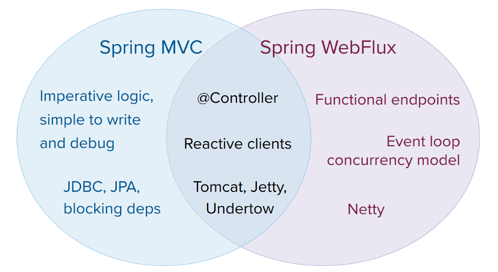
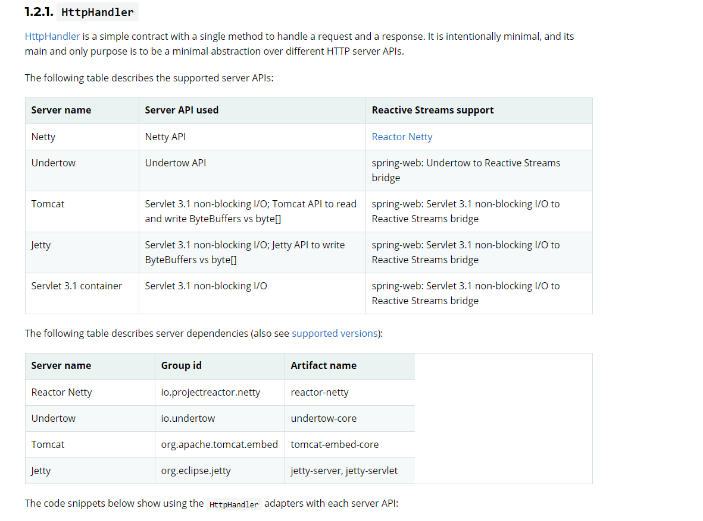
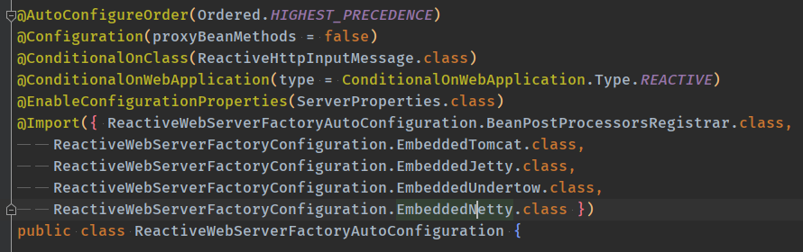

# 	WebFlux相关

## 介绍

webflux：webflux是spring项目下，基于reactor模式的非阻塞web服务端。

在[spring官网](https://docs.spring.io/spring-framework/docs/current/reference/html/web-reactive.html#webflux-framework-choice "webflux")介绍中，指明了webflux和传统springmvc的区别和共同点：



从图里可以看出，大部分springmvc的功能和注解webflux都可以使用，但是在一些阻塞的持久化API方面，webflux并不支持（由于webflux都是基于reactor-core的非阻塞api，传统jdbc是阻塞的）。官网原文写到：

> A simple way to evaluate an application is to check its dependencies. If you have blocking persistence APIs (JPA, JDBC) or networking APIs to use, Spring MVC is the best choice for common architectures at least. It is technically feasible with both Reactor and RxJava to perform blocking calls on a separate thread but you would not be making the most of a non-blocking web stack.

大致意思就是，如果要试用阻塞的持久层API，springmvc是通用体系内的最佳选择。如果一定要用，可以用Reactor和RxJava在单独的线程上执行阻塞API，但是这样对于非阻塞的web-stack来说，其性能不能得到充分的利用。

当然这里的不支持的说法，其实应该不是不能用这个意思。完全可以在非阻塞的逻辑中调用阻塞的api，但是由于nio的机制，并不是靠加大线程池去增加吞吐，有可能会导致耗时应用降低吞吐。

所以webflux比较适合io密集型的应用。

## 服务端的创建

### 一、`HttpHandler`

在整个webflux中，关键的是httphandler这个接口，这是处理request请求转发的关键。在spring适配中，目前有4种实现方式。[官网原文](https://docs.spring.io/spring-framework/docs/current/reference/html/web-reactive.html#webflux-httphandler)



### 二、实现

用netty实现的代码

```java
// 创建spring容器
AnnotationConfigApplicationContext applicationContext = new AnnotationConfigApplicationContext(Main.class);
// 创建httphandler
HttpHandler httpHandler = WebHttpHandlerBuilder.applicationContext(applicationContext).build();
// 适配为Reactor模式的API
ReactorHttpHandlerAdapter handlerAdapter = new ReactorHttpHandlerAdapter(httpHandler);
// 创建HTTPServer，并把之前的httpHandler放入，绑定端口等参数
DisposableServer server = HttpServer.create().handle(handlerAdapter).port(8081).bindNow();
server.onDispose().block();
```

## 关键流程

在启动Main.class中，有**EnableWebFlux**注解，该注解是开启webflux的配置。在该注解中，导入了**DelegatingWebFluxConfiguration**类，其中在**WebFluxConfigurationSupport**中注册了**RequestMappingHandlerMapping**和**DispatcherHandler**等webflux的组件，类似于springmvc中的HandlerMapping。

创建HttpHandler的流程其实就是把之前的spring容器注入到里面，并且把webflux的组件导入。applicationContext方法中的源码如下：

```java
//把WebHandler组件从容器中注入到Builder中，WebHandler的实现就是DispatcherHandler
WebHttpHandlerBuilder builder = new WebHttpHandlerBuilder(
				context.getBean(WEB_HANDLER_BEAN_NAME, WebHandler.class), context);
		List<WebFilter> webFilters = context
				.getBeanProvider(WebFilter.class)
				.orderedStream()
				.collect(Collectors.toList());
		builder.filters(filters -> filters.addAll(webFilters));
		List<WebExceptionHandler> exceptionHandlers = context
				.getBeanProvider(WebExceptionHandler.class)
				.orderedStream()
				.collect(Collectors.toList());
		builder.exceptionHandlers(handlers -> handlers.addAll(exceptionHandlers));
省略。。。。
```

其实就是把spring容器中的组件放到build中，然后生成一个适配的HttpHandler。然后通过spring实现的**ReactorHttpHandlerAdapter**，把组件注入到**HttpServer**中，**HttpServer**是基于Reactor-Netty的。

经过一系列的组装之后，httpserver把httphandler组装好，然后基于**HttpServerOperations**的状态改变，在每次状态改变时，都会调用onStateChange方法，最后调到**HttpServerHandle**的onStateChange方法：

```java
public void onStateChange(Connection connection, State newState) {
		if (newState == HttpServerState.REQUEST_RECEIVED) {
			try {
				if (log.isDebugEnabled()) {
					log.debug(format(connection.channel(), "Handler is being applied: {}"), handler);
				}
				HttpServerOperations ops = (HttpServerOperations) connection;
				Mono.fromDirect(handler.apply(ops, ops))
				    .subscribe(ops.disposeSubscriber());
			}
			catch (Throwable t) {
				log.error(format(connection.channel(), ""), t);
				//"FutureReturnValueIgnored" this is deliberate
				connection.channel()
				          .close();
			}
		}
	}
```

由其中的handler（就是一开始定义的ReactorHttpHandlerAdapter）处理请求内容。

之后的调用流程大概就是：

ReactorHttpHandlerAdapter.apply() --> HttpWebHandlerAdapter.handle() --> FilteringWebHandler.handle() --> DefaultWebFilterChain.filter() --> DispatcherHandler.handle()

### 作为mvc方法的调用

```java
@RestController
public class HelloController {

  private static final Logger log = LoggerFactory.getLogger(HelloController.class);

  @Resource
  Scheduler scheduler;

  @RequestMapping("/hello/{time}")
  public Mono<String> hello(@PathVariable("time") Long time){
    return Mono.delay(Duration.ofMillis(time)).then(Mono.just("hello world!")).publishOn(scheduler);
  }

}
```

webflux兼容大部分springmvc的注解，但是在返回方面，建议使用Reactor-core的Mono。并且使用publishOn方法通过异步调用。因为netty在大量并发下，传统的mvc调用，即返回一个对象这种情况，会出现大量的connection refused 报错，并且使用Scheduler有助于提高吞吐。


## springboot中的自动配置

springboot通常使用AutoConfigure自动配置类进行配置，webflux通用如此，自动配置的入口为**WebFluxAutoConfiguration**。

这里面的流程和@EnableWebflux相同，配置了httphandler，handlermapping等组件，这些是内部的配置，关于HttpServer的启动，在**ReactiveWebServerFactoryAutoConfiguration**中，



在这个配置类中，引入了支持的几种**ReactiveWebServerFactory**，以netty举例：

spring向容器中注入了**NettyReactiveWebServerFactory**

```java
@Configuration(proxyBeanMethods = false)
@ConditionalOnMissingBean(ReactiveWebServerFactory.class)
@ConditionalOnClass({ HttpServer.class })
static class EmbeddedNetty {

    @Bean
    @ConditionalOnMissingBean
    ReactorResourceFactory reactorServerResourceFactory() {
        return new ReactorResourceFactory();
    }

    @Bean
    NettyReactiveWebServerFactory nettyReactiveWebServerFactory(ReactorResourceFactory resourceFactory,
          ObjectProvider<NettyRouteProvider> routes, ObjectProvider<NettyServerCustomizer> serverCustomizers) {
        NettyReactiveWebServerFactory serverFactory = new NettyReactiveWebServerFactory();
        serverFactory.setResourceFactory(resourceFactory);
        routes.orderedStream().forEach(serverFactory::addRouteProviders);
        serverFactory.getServerCustomizers().addAll(serverCustomizers.orderedStream().collect(Collectors.toList()));
        return serverFactory;
    }

}
```

然后在启动时，即**SpringApplication**的run方法中，通过WebApplicationType.deduceFromClasspath()确定了当前容器的类型。如果引入webflux，则WebApplicationType就是REACTIVE类型，相应的创建的容器类型则是**AnnotationConfigReactiveWebServerApplicationContext**。

在**AnnotationConfigReactiveWebServerApplicationContext**的onRefresh方法中，通过createWebServer创建服务并启动。其中，createWebServer中是通过之前注册到容器中的**NettyReactiveWebServerFactory**。到此，服务已经启动了。