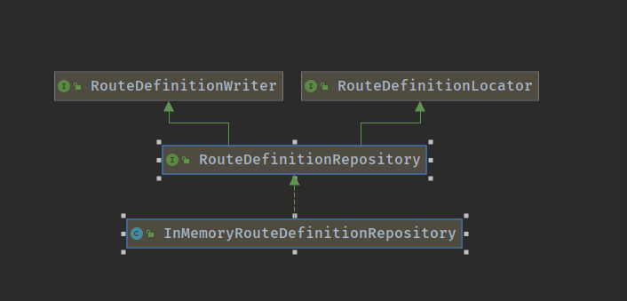
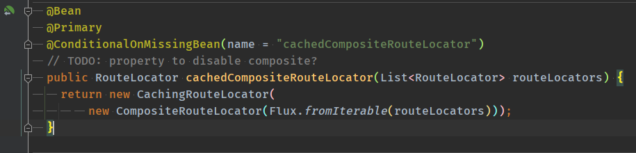

spring-cloud-gateway + actuator项目

实现基础的网关功能，actuator实现路由监控以及动态增删改查功能

注意点：

gateway默认的操作路由的接口是RouteDefinitionRepository，spring对其只有一个实现类InMemoryRouteDefinitionRepository

RouteDefinitionRepository类似于存储路由的库，其中RouteDefinitionWriter是对路由的增删操作，RouteDefinitionLocator是对路由的查询。

默认是存在内存中，并且gateway在处理请求的时候，是从缓存中获取路由，CachingRouteLocator是默认的路由获取类

这里有一个问题，系统启动的时候，从配置文件读取路由信息，然后组成路由，存在CachingRouteLocator。每次请求来的时候，RoutePredicateHandlerMapping处理请求，在lookupRoute方法中获取路由信息，lookupRoute方法从CachingRouteLocator获取路由。但是如果通过actuator增加路由，新的路由是存在InMemoryRouteDefinitionRepository中，并且在调用refresh的时候才会写入CachingRouteLocator。并且默认从配置文件里写的路由不能被删除，因为删除操作也是对InMemoryRouteDefinitionRepository操作的，并不能对CachingRouteLocator产生影响。